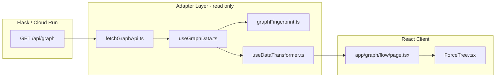

# IMPLEMENTATION_PLAN.md — AISIGNALGRAPH Signal Tree

**Target audience:** Autonomous coding agent  
**Output file:** `IMPLEMENTATION_PLAN.md` at repo root  
**Scope:** Rebuild or verify the `/graph/flow` visualization pipeline  
**Primary renderer:** `ForceTree` (d3-hierarchy + d3-force hybrid)  
**Alternate renderer:** `D3TreeContainer` (react-d3-tree wrapper, kept for reference)

---

## Architecture Overview



**Critical constraint:** Never mutate the API payload. All transformation produces new objects.

---

## Phase 0 — Prerequisites

- [ ] Working directory: `frontend-next/`
- [ ] Node via Volta (project uses `node@24.15.0`)
- [ ] Flask backend serves `GET /api/graph` on `:8080` (dev rewrite in `frontend-next/next.config.ts`)
- [ ] Feature flag: `NEXT_PUBLIC_GRAPH_FLOW=1` at build/dev time (`frontend-next/src/lib/graphFlow/featureFlag.ts`)

---

## Phase 1 — Install Dependencies

Run from `frontend-next/`:

```bash
npm install react-d3-tree d3-force
npm install -D @types/d3-force @types/d3-hierarchy @types/d3-selection @types/d3-zoom @types/d3-drag
```

**Expected `package.json` entries:**

| Package | Scope | Version (current) |
|---------|-------|-------------------|
| `react-d3-tree` | dependencies | `^3.6.6` |
| `d3-force` | dependencies | `^3.0.0` |
| `@types/d3-force` | devDependencies | `^3.0.10` |
| `@types/d3-hierarchy` | devDependencies | `^3.1.7` |
| `@types/d3-selection` | devDependencies | `^3.0.11` |
| `@types/d3-zoom` | devDependencies | `^3.0.8` |
| `@types/d3-drag` | devDependencies | `^3.0.7` |

- [ ] `node_modules/react-d3-tree` exists
- [ ] `node_modules/d3-force` exists
- [ ] No duplicate stray files under repo-root `/src/` (only `frontend-next/src/`)

---

## Phase 2 — Files to Create (Exact Paths)

### 2A — API boundary (read-only)

| File | Purpose |
|------|---------|
| `frontend-next/src/components/graph-flow/fetchGraphApi.ts` | Typed client for `GET /api/graph` |
| `frontend-next/src/lib/graphFlow/graphFingerprint.ts` | Dedup poll responses |
| `frontend-next/src/lib/graphFlow/featureFlag.ts` | `NEXT_PUBLIC_GRAPH_FLOW=1` gate |

### 2B — Hooks

| File | Purpose |
|------|---------|
| `frontend-next/src/hooks/useGraphData.ts` | Fetch + optional poll + revision |
| `frontend-next/src/hooks/useDataTransformer.ts` | Flat → nested tree adapter |

### 2C — Visualization components

| File | Purpose |
|------|---------|
| `frontend-next/src/components/visualization/ForceTree.tsx` | **Production** hybrid tree+physics renderer |
| `frontend-next/src/components/visualization/D3TreeContainer.tsx` | Alternate react-d3-tree renderer |

### 2D — Route

| File | Purpose |
|------|---------|
| `frontend-next/src/app/graph/flow/page.tsx` | `/graph/flow` page shell + wiring |

- [ ] All 8 files exist under `frontend-next/src/`
- [ ] Each file has `"use client"` where it uses hooks/browser APIs

---

## Phase 3 — API Types (`fetchGraphApi.ts`)

Implement and export:

```typescript
export interface GraphApiNode {
  id: string;
  label?: string;
  node_type?: string;
  type?: string;
  route?: string;
  description?: string;
  importance?: number;
  timeline_month?: string;
  year?: number;
  [key: string]: unknown;
}

export interface GraphApiEdge {
  source: string;
  target: string;
  flow_kind?: string;
  [key: string]: unknown;
}

export interface GraphApiPayload {
  nodes: GraphApiNode[];
  edges: GraphApiEdge[];
  communities?: GraphApiCommunity[];
  timeline?: { months?: string[]; start?: string; end?: string };
  status?: "ok" | "degraded";
  message?: string;
}
```

**Fetch rules:**

- URL: `${NEXT_PUBLIC_API_BASE}/api/graph?dataset=...` (base empty = same-origin)
- Headers: `Accept: application/json`, `Cache-Control: no-cache`
- Options: `cache: "no-store"`
- Return normalized arrays (never `undefined` for nodes/edges)
- **Do not** reshape node/edge objects

- [ ] Types exported
- [ ] `fetchGraphApi({ dataset?, signal? })` implemented
- [ ] Throws on non-OK response

---

## Phase 4 — Data Transformation (BFS + Synthetic Root)

**File:** `frontend-next/src/hooks/useDataTransformer.ts`

### Input / Output types

```typescript
import type { RawNodeDatum } from "react-d3-tree";

export interface DataTransformerInput {
  nodes: GraphApiNode[];
  edges: GraphApiEdge[];
}

export function useDataTransformer(
  input: DataTransformerInput | null,
  revision: string | null,
): RawNodeDatum | null;
```

### Algorithm (exact steps — do not mutate input)

**Step 1 — Index nodes**

```
nodeById = Map<id, GraphApiNode>
for each node in input.nodes:
  if node.id is string → nodeById.set(node.id, node)
```

**Step 2 — Build adjacency + in-degree from edges**

```
childIds = Map<id, string[]>   // source → [targets]
inDegree = Map<id, number>     // all ids init 0
for each edge in input.edges:
  if both source and target exist in nodeById:
    childIds[source].push(target)
    inDegree[target] += 1
```

**Step 3 — Find natural roots**

```
roots = all ids where inDegree[id] === 0
if roots is empty and nodeById not empty:
  roots = [ id with max(node.importance) ]   // cyclic fallback
```

**Step 4 — BFS tree build (cycle-safe, one parent per node)**

```
visited = Set<string>

function buildNode(id):
  visited.add(id)
  node = nodeById[id]
  childIdList = childIds[id] sorted by:
    importance DESC, tie-break year DESC
  children = []
  for childId in childIdList:
    if childId not in visited:
      children.push(buildNode(childId))
  return {
    name: node.label ?? node.id,
    attributes: toAttributes(node),  // includes id, strips label
    ...(children.length ? { children } : {})
  }
```

**Step 5 — Attach all top-level trees under synthetic root**

```
topLevel = []
for rootId in roots sorted by year ASC:
  if rootId not in visited → topLevel.push(buildNode(rootId))
for id in nodeById.keys():
  if id not in visited → topLevel.push(buildNode(id))  // orphan/cycle survivors

return {
  name: "AISIGNALGRAPH",
  attributes: { id: "__root__", type: "root", nodeCount: nodeById.size },
  children: topLevel
}
```

**Step 6 — `toAttributes(node)`**

- Always set `attributes.id = node.id`
- Copy other scalar fields (string | number | boolean only)
- Skip `id` and `label` keys
- Never write back to `node`

**Step 7 — Memoization**

```typescript
useMemo(() => input ? buildTree(input) : null, [input, revision])
```

`revision` from fingerprint prevents re-transform on identical polls.

- [ ] `buildTree` is pure (no input mutation)
- [ ] Synthetic root id is `"__root__"`
- [ ] `computePriorityScore` exported (optional helper for sorting)

---

## Phase 5 — Data Fetch Hook (`useGraphData.ts`)

```typescript
export interface UseGraphDataOptions {
  dataset?: string;
  refreshMs?: number;  // 0 = fetch once; 30000 = live poll
}

export interface UseGraphDataResult {
  payload: GraphApiPayload | null;
  revision: string | null;
  loading: boolean;
  error: Error | null;
}
```

**Fingerprint** (`frontend-next/src/lib/graphFlow/graphFingerprint.ts`):

```
`${nodes.length}|${edges.length}|${nodeIds joined}|${edgeKeys joined}|${status}`
```

Only call `setPayload` / `setRevision` when fingerprint changes.

- [ ] AbortController on unmount
- [ ] Poll interval cleared on cleanup
- [ ] Identical poll does NOT reset downstream tree state

---

## Phase 6 — D3TreeContainer (Alternate Renderer)

**File:** `frontend-next/src/components/visualization/D3TreeContainer.tsx`

### Props and types

```typescript
import Tree, {
  type CustomNodeElementProps,
  type RawNodeDatum,
} from "react-d3-tree";

export interface D3TreeContainerProps {
  /** Hierarchical tree from useDataTransformer */
  data: RawNodeDatum | null;
  /** Collapse branches beyond this depth on first render */
  initialDepth?: number;  // default: 1
}
```

### Required behavior

- [ ] `"use client"` directive
- [ ] `dynamic(..., { ssr: false })` when imported from page
- [ ] `ResizeObserver` on container → pass `dimensions` to `<Tree>`
- [ ] `renderCustomNodeElement` — branded document card via `foreignObject`
- [ ] Tree props: `orientation="horizontal"`, `collapsible`, `zoomable`, `draggable`
- [ ] Type-colored left border from `nodeDatum.attributes.type`
- [ ] CSS float animation on cards (optional organic feel)

### Tree component props reference

| Prop | Value |
|------|-------|
| `data` | `RawNodeDatum` from adapter |
| `translate` | `{ x: width/2, y: height/2 }` |
| `dimensions` | `{ width, height }` from container |
| `pathFunc` | `"step"` |
| `initialDepth` | `1` |
| `shouldCollapseNeighborNodes` | `true` |
| `zoom` | `0.7` |
| `scaleExtent` | `{ min: 0.1, max: 3 }` |
| `nodeSize` | `{ x: 260, y: 90 }` |
| `separation` | `{ siblings: 1, nonSiblings: 1.4 }` |
| `centeringTransitionDuration` | `600` |

---

## Phase 7 — ForceTree (Production Renderer)

**File:** `frontend-next/src/components/visualization/ForceTree.tsx`

### Props and types

```typescript
export interface ForceTreeProps {
  data: RawNodeDatum | null;
  dataRevision?: string | null;
  initialSeedCount?: number;           // default: 12
  onVisibleCountChange?: (n: number) => void;
  onNodeSelect?: (node: RawNodeDatum) => void;
}
```

### Priority-based initial disclosure

`buildPriorityCollapsed(data, seedCount)`:

- Score each direct child of `__root__`: `0.6 * norm(importance) + 0.4 * norm(outDegree)`
- Top `seedCount` (default 12) start **expanded**
- All other branches with children default **collapsed**
- User toggles stored in `Map<string, boolean>`; preserved across polls unless `dataRevision` changes

### Hybrid layout + physics

1. `d3.hierarchy(data, d => collapsed.has(id) ? null : d.children)`
2. `d3.tree().size([2 * Math.PI, maxRadius])` — radial skeleton
3. Map tree coords → screen anchors (`applyRadialAnchors`, root at center)
4. `d3.forceSimulation` with:
   - `forceLink` distance ~140 (viewport-scaled), strength 0.2
   - `forceManyBody` strength -180, distanceMax 600
   - `forceCollide` radius = visualR + 8
   - `forceCenter(cx, cy)` strength 0.04
   - `forceX/Y` toward anchors strength 0.045
   - `velocityDecay` 0.22, `alphaDecay` 0.006

### Hit targets (scalability)

- [ ] Invisible `.signal-tree__hit` circle: `r = max(18, visualR + 12)`
- [ ] Links: `pointer-events: none`
- [ ] Nodes sorted by depth ascending (deeper on top)
- [ ] d3-zoom `.filter()` excludes `.signal-tree__node`
- [ ] 3px drag threshold before suppressing click-toggle
- [ ] Layout mirrored in `useState`, not only `useRef`
- [ ] Circular nodes with type-colored rings + optional labels (hidden when >60 visible)
- [ ] Positions persisted in `positionsRef` across expand/collapse
- [ ] Periodic reheat only when visible ≤ 80 nodes

---

## Phase 8 — Page Wiring

**File:** `frontend-next/src/app/graph/flow/page.tsx`

```typescript
const ForceTree = dynamic(() => import("@/components/visualization/ForceTree"), { ssr: false });

const { payload, revision, loading, error } = useGraphData({ refreshMs: 30_000 });
const graphInput = useMemo(() => payload ? { nodes, edges } : null, [payload]);
const tree = useDataTransformer(graphInput, revision);

<ForceTree
  data={tree}
  dataRevision={revision}
  initialSeedCount={12}
  onVisibleCountChange={setVisibleNodes}
/>
```

HUD must show: **Visible** / **Indexed** / **Edges**

- [ ] Feature flag gate renders disabled message when flag off
- [ ] Loading and error states present
- [ ] `graphInput` memoized on `payload` reference only

---

## Phase 9 — Build & Deploy

Dev:

```bash
# terminal 1 — repo root
./venv/bin/python app.py

# terminal 2 — frontend-next
NEXT_PUBLIC_GRAPH_FLOW=1 npm run dev
# → http://localhost:3000/graph/flow
```

Production static export:

```bash
cd frontend-next
NEXT_PUBLIC_GRAPH_FLOW=1 npm run build:hub
# copies out/ → webapp/static/hub/
```

Optional split API:

```bash
NEXT_PUBLIC_GRAPH_FLOW=1 NEXT_PUBLIC_API_BASE=https://your-cloud-run-url npm run build:hub
```

- [ ] `/graph/flow` reachable via Flask hub
- [ ] `/api/graph` returns `{ nodes, edges, status: "ok" }`

---

## Phase 10 — Verification Checklist

### Data integrity

- [ ] `fetchGraphApi` returns same node count as Flask `/api/graph`
- [ ] Original `GraphApiNode` objects never mutated in adapter
- [ ] Synthetic root has `attributes.id === "__root__"`
- [ ] Poll with identical data does NOT reset expand state or node positions

### Initial render

- [ ] Page loads with **Visible ≈ 13** (root + top-12), **Indexed ≈ 1000+**
- [ ] No hairball (not all nodes rendered at once)
- [ ] Root node centered; children radiate outward

### Interaction

- [ ] Click node with dashed ring (`+`) expands children
- [ ] Click again collapses
- [ ] Peripheral / deep nodes are clickable (hit circle works)
- [ ] Drag node → release → springs back with momentum
- [ ] Pan/zoom on empty canvas works; zoom does not steal node clicks
- [ ] Leaf click fires `onNodeSelect` (no-op on page is OK)

### Live updates

- [ ] After 30s poll, tree updates only when scraper changes data
- [ ] User expand/collapse preserved on identical polls

### TypeScript / lint

- [ ] `npx tsc --noEmit` — no errors in edited files
- [ ] `npm run lint` on edited files passes

### Visual regression (manual)

- [ ] Circular nodes with type-colored halos
- [ ] Links taper thinner with depth
- [ ] Labels hidden when >60 nodes visible
- [ ] HUD shows Visible / Indexed / Edges

---

## Agent Progress Tracker (master checklist)

- [ ] Phase 0 — Prerequisites verified
- [ ] Phase 1 — Dependencies installed
- [ ] Phase 2 — All 8 files created
- [ ] Phase 3 — API types + fetch client
- [ ] Phase 4 — BFS + synthetic root adapter
- [ ] Phase 5 — useGraphData + fingerprint
- [ ] Phase 6 — D3TreeContainer (alternate)
- [ ] Phase 7 — ForceTree (production)
- [ ] Phase 8 — Page wiring
- [ ] Phase 9 — Build/deploy config
- [ ] Phase 10 — All verification checks pass
