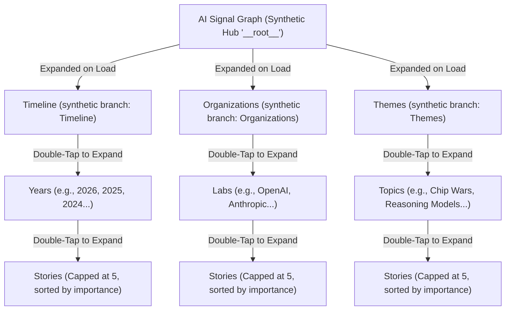

# AISIGNALGRAPH — Claude's Development Report & Future Improvements
> **Date:** June 17, 2026  
> **Repository:** `DiggityDooo/AISIGNALGRAPH`  
> **Focus:** Webapp background ingestion, WebGL Lattice Mode scaling, and progressive disclosure parity for Flow & Tree modes on `/graph/flow`.

---

## Executive Summary
Today's development was focused on solving severe UI scale issues (collapsing the D3-force renderer under a 1000+ node corpus), fixing data freshness issues (new scraped stories only loading at startup), and refining the UX structure of the Tree and Flow modes so they serve as structured directory layouts rather than unstructured lists of orphan story nodes. 

All tests passed, and the Next.js frontend builds cleanly with no warnings.

---

## 1. Summary of Changes Completed Today

### A. WebGL Lattice Mode Migration (Sigma.js)
* **Problem:** The previous Lattice implementation (`ForceTree.tsx`) used SVG + D3-force, which choked when trying to render the full corpus (~1000+ nodes and ~6000+ edges) at interactive framerates. Consequently, it was forced to display only a small subset of nodes.
* **Solution:** Replaced it with [SigmaLatticeGraph.tsx](file:///home/seanb/Documents/December%202023/frontend-next/src/components/visualization/SigmaLatticeGraph.tsx) utilizing **Sigma.js** and **WebGL**.
* **Key Enhancements:**
  * Displays the entire corpus with no caps or progressive disclosure limitations (interactive performance > 60fps).
  * Uses a single-pass `ForceAtlas2` layout with Barnes-Hut optimization ($O(N \log N)$ repulsion complexity instead of $O(N^2)$).
  * Node positions are cached and persist across data refreshes, avoiding sudden reshuffles when new stories are scraped.
  * Node sizing is mapped directly to true graph degrees (`graph.degree()`) computed in WebGL after all edges are added, preventing size discrepancies.
  * Deleted deprecated files: `ForceTree.tsx` and `useDataTransformer.ts`.
  * Updated Playwright E2E walkthrough test.

### B. Live background data ingestion
* **Problem:** Stories scraped 4 times a day to Google Cloud Storage (GCS) were only loaded into the SQLite DB when the Flask server restarted. Warm instances could serve stale data for hours.
* **Solution:** Modified `GraphStore._refresh()` in [graph_store.py](file:///home/seanb/Documents/December%202023/webapp/graph_store.py#L1919-L1947) to run a throttled database ingestion check.
* **Key Enhancements:**
  * Checks for new GCS objects every 5 minutes (`_INGEST_CHECK_INTERVAL_SECONDS = 300`).
  * Runs inside a non-blocking lock (`self._ingest_lock.acquire(blocking=False)`) to prevent concurrent requests from executing overlapping database writes on SQLite.
  * Failure-tolerant: network or storage failures are logged as non-fatal warnings rather than breaking graph reads.
  * Added extensive thread-safe regression unit tests in [test_graph_store_core.py](file:///home/seanb/Documents/December%202023/tests/test_graph_store_core.py#L595-L687).

### C. Live-Data Navigation Sections (Timeline, Organizations, Themes)
* **Problem:** The central hub card previously fanned out directly to whatever was ranked highest by `pickSeedIds(index.rootIds)`. In production, this resulted in orphaned labor/job stories (e.g. "Junior Software Engineer", "Cashier") filling the top-level cards because they lacked an `event_date` (meaning no incoming year edges).
* **Solution:** Created a navigation overlay system in [navigationSeeds.ts](file:///home/seanb/Documents/December%202023/frontend-next/src/lib/graphFlow/navigationSeeds.ts) to structure the top-level branches into three clear, data-driven directories:
  1. **Timeline:** Direct link to year nodes (e.g. 2026, 2025, 2024...) in descending chronological order.
  2. **Organizations:** Links to key research labs and companies (e.g. OpenAI, Anthropic...) sorted by database importance.
  3. **Themes:** Links to high-level topics (excluding job roles and employment keywords).
* **Key Enhancements:**
  * Fixed a bug where a BFS spanning tree dropped ~10% of year-to-story connections (e.g., losing Claude 3's release from 2025). Years now compute children directly from the raw edge lists.
  * Added a `tsx` developer dependency and configured `npm test` script to allow running tests with TSX (`node --import tsx --test`), resolving local path alias resolution issues.

### D. Tree & Flow Mode Progressive Disclosure Alignment
* **Problem:** Tree mode loaded too many nodes (16-24+ cards) on first paint because it expanded roots and grandchildren immediately. Flow mode was static, rendering a fixed BFS slice with no expand/collapse capabilities.
* **Solution:** Unified both modes under a shared progressive disclosure state hook ([useProgressiveGraph.ts](file:///home/seanb/Documents/December%202023/frontend-next/src/hooks/useProgressiveGraph.ts)).
* **Key Enhancements:**
  * **Tree Mode:** Set default expansion to the synthetic hub only. Roots now load collapsed (showing a `+N` badge) to meet the $\le 7$ nodes target on first paint.
  * **Flow Mode:** Replaced static BFS slicing with `useProgressiveGraph` and `getLayoutedElements(..., "flow")`. Flow mode now starts small (hub + 3 section cards) and expands rightward (LR layout) on double-tap, matching Tree's behavior.
  * Memoized the hub-children selection mapping once per graph revision to eliminate sorting overhead during expand/collapse triggers.

---

## 2. Target Graph Navigation Architecture

The diagram below details the unified navigation directory structure created today:

---

## 3. Recommended Future Improvements

### A. Performance Improvements
1. **Offload ForceAtlas2 Layout from Main Thread in Lattice Mode:**
   * *Current Status:* `forceAtlas2.assign(...)` runs synchronously inside a React `useEffect` hook in [SigmaLatticeGraph.tsx](file:///home/seanb/Documents/December%202023/frontend-next/src/components/visualization/SigmaLatticeGraph.tsx#L147). For 1000+ nodes and 6000+ edges, 120 iterations of FA2 layout calculations block the browser's main thread for 150-400ms, causing a noticeable UI stutter when mounting the Lattice tab.
   * *Improvement:* Spin up a Web Worker specifically for the ForceAtlas2 layout computation (similar to `graphTransform.worker.ts`), or run the layout progressively over several frames using `forceAtlas2.start(...)` and stop it after a fixed duration, which yields smooth frame transitions.

2. **Web Worker Circuit Breaker:**
   * *Current Status:* If the graph transformer worker crashes or fails, [useProgressiveGraph.ts](file:///home/seanb/Documents/December%202023/frontend-next/src/hooks/useProgressiveGraph.ts#L285-L298) catches the error, terminates the worker, and falls back to synchronous main-thread execution. However, on subsequent data refreshes/polling revisions, it will try to spin up a new worker again.
   * *Improvement:* Introduce a persistent failure state ref (`workerFailedRef = true`) so that once the worker fails once, subsequent renders bypass worker creation entirely and fall back directly to synchronous execution.

### B. User Experience (UX) & Accessibility (a11y)
1. **"Load More" Card for Capped Navigation Items:**
   * *Current Status:* Sections are capped to `DEFAULT_SECTION_FAN_OUT = 3` (e.g., showing only top 3 labs or top 3 themes) and stories are capped to `DEFAULT_STORY_FAN_OUT = 5` in [navigationSeeds.ts](file:///home/seanb/Documents/December%202023/frontend-next/src/lib/graphFlow/navigationSeeds.ts#L18-L22). Any items beyond this cap are completely unreachable on the Progressive Card Graph views.
   * *Improvement:* Add a special synthetic "Load More (+N)" node at the end of the children array when the count exceeds the fan-out limit. Double-tapping this card should increase the fan-out limit for that node in the component's state.

2. **Smooth Viewport Centering on Lattice Node Selection:**
   * *Current Status:* Clicking a node in [SigmaLatticeGraph.tsx](file:///home/seanb/Documents/December%202023/frontend-next/src/components/visualization/SigmaLatticeGraph.tsx#L192) dims unrelated nodes and edges, but the camera position remains stationary unless the user double-clicks.
   * *Improvement:* Utilize Sigma's camera APIs (`renderer.getCamera().animate(...)`) to smoothly center and zoom in on the focused node and its immediate neighbor neighborhood when clicked.

3. **Contrast Ratio Auditing for Dimmed Nodes:**
   * *Current Status:* Unfocused nodes in Lattice mode are rendered with opacity `rgba(120, 120, 120, 0.12)`.
   * *Improvement:* Verify contrast ratios against WCAG AA guidelines to ensure the faint grey circles are sufficiently visible on dark backgrounds for accessibility.

### C. Clean Architecture & Code Health
1. **Reset Expanded State on Data Revision Changes:**
   * *Current Status:* In `useProgressiveGraph.ts`, `defaultsAppliedRef` ensures that default expanded states are only set once. If the user shifts to a completely different database or a major revision, the old set of `expandedIds` is preserved, potentially retaining dangling IDs.
   * *Improvement:* Reset `defaultsAppliedRef.current = false` inside a `useEffect` keyed on the `dataRevision` dependency.

2. **Backend Redundant Edge Pruning:**
   * *Current Status:* The backend `/api/graph` payload emits redundant bidirectional associations, e.g. both `year -> story` (timeline edges) and `story -> year` (mention edges).
   * *Improvement:* Prune `story -> year` mention edges on the Flask backend. Since the timeline navigation works purely on `year -> story` mapping, removing these redundant relations will shrink the JSON payload size by roughly 8-12%, speeding up initial loading times and decreasing parsing costs.

3. **Robust Category Classification in Database:**
   * *Current Status:* The database lacks a clean separation between AI topics and job roles, forcing the frontend to resort to regex-matching (`JOB_ROLE_PATTERN` in `navigationSeeds.ts`) on titles/labels.
   * *Improvement:* Introduce a dedicated category column in the database's `entities` table so the frontend can query true topics without brittle text matching.
