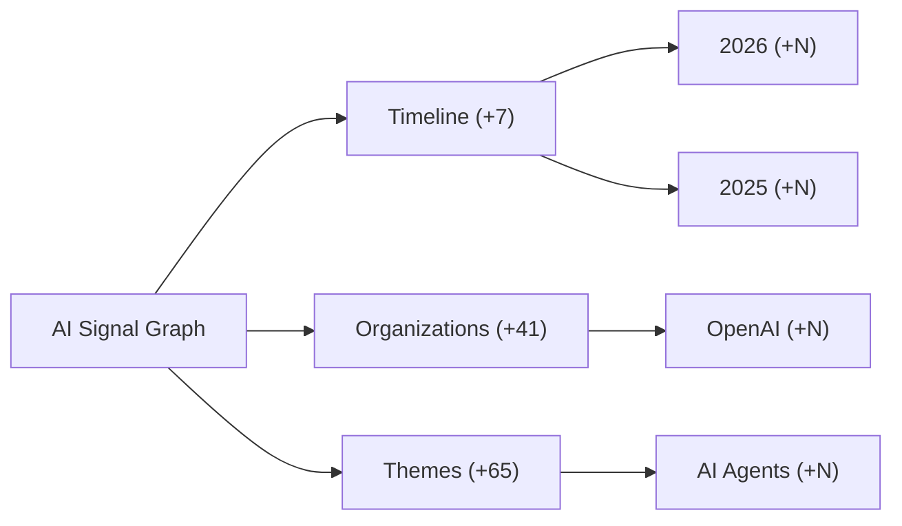

# Implementation Plan: Graph Navigation Seeds & Sectionized Startup

> **For Claude/agents.** Read this before changing Tree, Flow, or Lattice startup behavior.  
> **Route:** `/graph/flow`  
> **Related:** `docs/graph-modes-sectionized-reference.md` (mode differences)

---

## Overview

Tree and Flow must open on **generalized, live-database anchors** — not random high-importance orphan stories. The user expands outward into a large graph over time, but the **first screen** should read like a table of contents:

```
AI Signal Graph
├── Timeline          (+7)   → 2020 … 2026 (year entities from DB)
├── Organizations     (+N)   → OpenAI, Anthropic, Google DeepMind, …
└── Themes            (+N)   → Reasoning Models, AI Agents, Chip Wars, …
```

Each section is a **different lens** on the same live corpus. They must not be three unrelated story cards (e.g. Junior Software Engineer + Hinton paper + Dartmouth) sitting as siblings under the hub.

---

## Specification Link

Source of truth for graph data:

| Layer | Source |
|-------|--------|
| Live nodes/edges | `GET /api/graph` → `GraphStore.get_graph_data()` |
| DB | `data/ai_graph.db` (stories, entities, links) |
| Canonical umbrellas | `ENTITY_DEFINITIONS` in `webapp/graph_store.py` |
| Frontend transform | `buildGraphIndexFromPayload()` → `useProgressiveGraph` |

**User requirements (non-negotiable):**

1. **Live data only** — first-level cards must map to real nodes in `/api/graph`, updated as the scraper/DB updates. No hardcoded fake story titles in the frontend.
2. **Generalized starters** — prefer `year`, umbrella `lab`/`company`, umbrella `topic`/`model` families. Not job-displacement stories, not individual persons, not one-off narrative headlines as hub children.
3. **Sectionized** — the three (or few) hub children must be **coherent sections**, not three unrelated items ranked by `seedScore`.
4. **Progressive** — hub expanded on load; sections collapsed with `+N`; no grandchildren until double-tap expand. Target `VISIBLE ≤ 7` on first paint.

---

## Why It Breaks Today (Root Cause)

Verified against local `GraphStore` (production shape is the same, larger):

### 1. Wrong pool for hub children

`pickSeedIds()` ranks `index.rootIds` — nodes with **in-degree zero** in the flat edge list.

In the live graph, **all 10 roots are `story` nodes**. Examples:

| Root story | importance | Why it's a root |
|------------|------------|-----------------|
| Junior Software Engineer | 5 | Jobs-table story, **no `event_date`** → no `year → story` edge |
| Cashier | 4 | Same — labor appendix orphan |
| Enterprise NLP startup | 4 | Orphan story |

Year nodes **exist** (`2020`–`2026`, type `year`) but are **never roots** — they have high in-degree because stories also link **to** year entities via `story → entity:year-YYYY` mention edges.

### 2. `seedScore` prefers the wrong types

```ts
// graphTransform.ts — story weight = 1.0, year = 0.86
SEED_TYPE_WEIGHT = { story: 1, topic: 0.95, lab: 0.92, year: 0.86, ... }
```

Orphan labor stories combine max type weight + high importance + many children → they win hub slots.

### 3. Progressive UI is fixed; seed **selection** is not

`useProgressiveGraph` correctly starts with hub-only `expandedIds`. But `buildEffectiveChildrenById()` attaches the hub to `pickSeedIds(index, 3)` from **orphan stories**, not years/labs/topics.

### 4. What the user sees (production screenshot)

Three sibling cards under the hub that mix **labor prediction**, **historical ML paper**, and **founding event** — semantically unrelated because they were never meant to be sibling navigation sections.

---

## Target Behavior

### First paint (Tree `TB` and Flow `LR`)

| Visible | Node | Source |
|---------|------|--------|
| 1 | AI Signal Graph | synthetic `__root__` |
| 2 | Timeline | section anchor → DB year nodes |
| 3 | Organizations | section anchor → DB lab entities |
| 4 | Themes | section anchor → DB topic entities |

All section cards show `+N` and are **collapsed**. `VISIBLE = 4`.

### After expanding Timeline

| Visible | Examples |
|---------|----------|
| +3–7 | `2026`, `2025`, `2024` (year entities, live) |

Each year shows `+N` where N = count of `year → story` edges in payload (e.g. 88 for 2024).

### After expanding 2024

Stories for 2024 appear (from existing `year → story` edges). Still no entity grandchildren until story expand (optional deeper phase).

### Section content rules

| Section | Include (from live API) | Exclude |
|---------|-------------------------|---------|
| **Timeline** | `type === "year"` | — |
| **Organizations** | `type === "lab"` (companies/labs), high `importance` or `story_count` | persons, job keywords |
| **Themes** | `type === "topic"` umbrellas (`Reasoning Models`, `AI Agents`, …) | labor/job role keywords |

Sort within section:

- Years: descending numeric label (`2026` first)
- Labs/topics: `importance` desc, then `story_count` desc

Cap first expand fan-out (e.g. show 5 years, 5 labs, 5 topics) — rest stay behind `+N` on the section card or paginate on expand.

---

## Technical Approach

### Principle: navigation tree ≠ raw graph roots

Do **not** use `index.rootIds` for hub children. Build a **navigation overlay**:

```
navigationChildren(hub) → [section:timeline, section:orgs, section:themes]
navigationChildren(section:timeline) → pickYearNodes(payload, limit)
navigationChildren(section:orgs) → pickLabNodes(payload, limit)
navigationChildren(section:themes) → pickTopicNodes(payload, limit)
navigationChildren(year) → existing childrenById year→story edges
navigationChildren(lab|topic) → stories/entities linked via payload edges (define rule)
```

Section nodes can be:

- **Synthetic** (`section:timeline`, not in DB) — label only, children resolved from live payload; or
- **Real DB topic nodes** used as section headers if they already exist (e.g. a curated `ENTITY_DEFINITIONS` entry).

Prefer **synthetic section IDs** for the three hub children so grouping is stable regardless of scraper noise.

### Where to implement

| Option | Pros | Cons |
|--------|------|------|
| **A. Frontend only** (`pickNavigationSeeds.ts`) | Fast, no deploy coupling | Section logic duplicated if other clients need it |
| **B. API field** (`navigation_roots` on `/api/graph`) | Single source of truth | Requires Flask change + frontend consume |
| **C. GraphStore edge fix** (stop `story→year` mention edges) | Cleans topology | Large behavior change; doesn't alone create sections |

**Recommended:** **A now, B later** — ship frontend navigation overlay first; add API metadata when stable.

---

## Phases

### Phase 1 — Navigation seed picker (frontend)

**Goal:** Replace `pickSeedIds(index, n)` for hub children.

- [ ] Add `frontend-next/src/lib/graphFlow/navigationSeeds.ts`
  - `NAVIGATION_SECTIONS` constant: Timeline / Organizations / Themes
  - `pickYearSeeds(payload, limit)` — filter `type === "year"`, sort desc
  - `pickLabSeeds(payload, limit)` — filter `type === "lab"`, rank by importance
  - `pickTopicSeeds(payload, limit)` — filter `type === "topic"`, exclude `group`/`color_group` matching Labor/job keywords
  - `buildNavigationChildrenById(index, payload)` — merge synthetic sections + real children maps
- [ ] Wire into `useProgressiveGraph.ts` instead of `pickSeedIds` for `SYNTHETIC_ROOT_ID` children only
- [ ] Keep `index.childrenById` for year→story and story→entity descent unchanged below sections

**Files:** `navigationSeeds.ts`, `useProgressiveGraph.ts`, `syntheticRoot.ts` (section ID constants)

### Phase 2 — Synthetic section nodes in card builder

**Goal:** Section cards render like real cards with `+N` badges.

- [ ] Extend `buildEffectiveNodeById()` with synthetic section nodes:
  - `section:timeline` → label `Timeline`, `nodeType: "topic"` or new `"section"`
  - `section:organizations` → `Organizations`
  - `section:themes` → `Themes`
- [ ] `childCount` = number of resolved DB children for that section
- [ ] `DocumentCardNode`: optional `section` styling (subtle border) — minimal change

**Files:** `useProgressiveGraph.ts`, `DocumentCardNode.tsx`, `nodeColors.ts`

### Phase 3 — Flow + Tree parity

**Goal:** Both modes use the same navigation overlay; only layout direction differs.

- [ ] Confirm `SignalCardGraph` uses `useProgressiveGraph` (already does)
- [ ] Confirm `ProgressiveTreeGraph` uses same hook (already does)
- [ ] Remove dead `flowElements.ts` references from docs if file deleted
- [ ] `initialSeedCount` on hub means **max items per section on first section expand**, not “pick N orphan stories” — rename prop to `navigationFanOut` or document clearly

**Files:** `page.tsx`, `SignalCardGraph.tsx`, `ProgressiveTreeGraph.tsx`

### Phase 4 — Tests

- [ ] `navigationSeeds.test.mjs`: hub children are section IDs, never `story:*` labor titles
- [ ] `navigationSeeds.test.mjs`: expanding `section:timeline` yields only `year` nodes
- [ ] `useProgressiveGraph` integration: first paint visible count ≤ 7
- [ ] Regression: Junior Software Engineer **not** visible until user drills into a labor-related branch

**Files:** `frontend-next/src/lib/graphFlow/navigationSeeds.test.mjs`

### Phase 5 — Optional API hardening (backend)

**Goal:** Cleaner topology at source.

- [ ] `graph_store.py`: stop emitting `story → entity:year-*` mention edges (timeline already uses `year → story`)
- [ ] Optional: add `navigation` block to `/api/graph` response with precomputed section membership
- [ ] Filter jobs-table synthetic stories from being promotable roots in any future root-based logic

**Files:** `webapp/graph_store.py`, `tests/test_graph_store_graph_data.py`

### Phase 6 — Lattice (do not break)

Lattice (`ForceTree`) keeps its own `buildPriorityCollapsed` over `buildTreeFromPayload` tree. **Do not** copy navigation sections into force layout without explicit request. Cross-link via “View in Lattice” only.

---

## Dependencies

| Dependency | Status |
|------------|--------|
| `/api/graph` returns year, lab, topic nodes | ✅ Present (7 years, 41 labs, 65 topics locally) |
| `year → story` edges | ✅ Present (e.g. 88 stories under 2024) |
| Progressive expand/collapse | ✅ `useProgressiveGraph` + `CardGraphCanvas` |
| Synthetic hub `__root__` | ✅ Already used |

**Blockers:** None for Phase 1–4.

---

## Risks & Mitigations

| Risk | Mitigation |
|------|------------|
| Section expand shows too many year stories (88+) | Cap visible children per expand; show top-N by importance with `+N` for remainder |
| Lab/topic → children unclear | Phase 1: labs/topics expand to **linked stories** via outgoing edges in payload; document rule in tests |
| Production DB differs from local | Picker filters by `type`, not hardcoded IDs — works on any corpus with year/lab/topic nodes |
| Duplicate docs confuse agents | `CLAUDE.md` points here; mark `flow-tree-progressive-reference.md` as superseded for **seed selection** |

---

## Acceptance Criteria

- [ ] First paint: hub + **3 section cards** (Timeline, Organizations, Themes). No story cards at top level.
- [ ] Junior Software Engineer **not** among first-level hub children.
- [ ] Expanding Timeline shows **year** nodes from live API (e.g. 2026, 2025, 2024).
- [ ] Expanding a year shows **story** nodes for that year (from existing edges).
- [ ] All displayed nodes exist in `/api/graph` payload (synthetic allowed: `__root__`, `section:*` only).
- [ ] Tree and Flow behave identically for navigation; only layout axis differs.
- [ ] `VISIBLE ≤ 7` on first paint; grows only on user expand.
- [ ] Indexed/edge counts in header still reflect full corpus.

---

## File Map

| File | Change |
|------|--------|
| `frontend-next/src/lib/graphFlow/navigationSeeds.ts` | **NEW** — section picker |
| `frontend-next/src/lib/graphFlow/navigationSeeds.test.mjs` | **NEW** — tests |
| `frontend-next/src/hooks/useProgressiveGraph.ts` | Use navigation overlay for hub children |
| `frontend-next/src/lib/graphFlow/syntheticRoot.ts` | Section ID constants |
| `frontend-next/src/lib/graphFlow/graphTransform.ts` | Deprecate `pickSeedIds` for hub use; keep for Lattice if needed |
| `frontend-next/src/app/graph/flow/page.tsx` | Clarify props / counts |
| `webapp/graph_store.py` | Phase 5 optional edge cleanup |
| `docs/graph-modes-sectionized-reference.md` | Link here; fix stale Flow description |

---

## Anti-Patterns (do not ship)

| Don't | Why |
|-------|-----|
| Rank `index.rootIds` for hub children | Roots are orphan labor stories |
| Use `seedScore` across mixed types as sibling sections | Produces semantically unrelated cards |
| Hardcode "Dartmouth", "Hinton" in frontend | Not live/generalized; breaks on DB update |
| Show 80+ year stories on first year expand | Defeats progressive disclosure |
| Make Lattice use the same 3-section hub | Different mode, different purpose |

---

## Mermaid — Target navigation



---

## Implementation Order (for Claude)

1. `navigationSeeds.ts` + tests (no UI yet)
2. Wire `buildEffectiveChildrenById` to sections
3. Synthetic section nodes in `buildEffectiveNodeById`
4. Manual verify Tree then Flow on `/graph/flow`
5. Update `graph-modes-sectionized-reference.md` stale Flow section
6. Optional backend edge cleanup

**Stop condition:** First screen shows three sections, not three stories.
