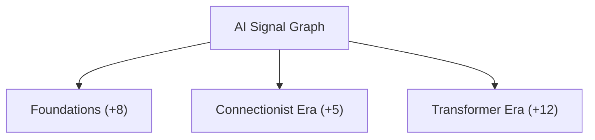
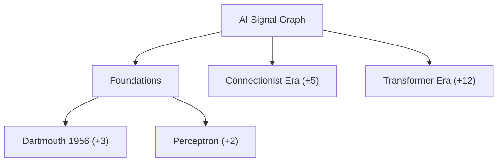
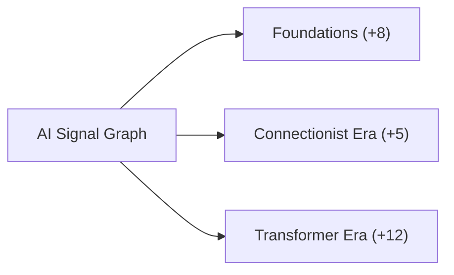

# Flow & Tree — Progressive Disclosure Reference

> **Audience:** Claude and other agents working on AISIGNALGRAPH graph UI.  
> **Route:** `/graph/flow` — modes **TREE**, **FLOW**, **LATTICE** (Lattice is separate; see end).  
> **Core rule:** The graph must **not** open massive. It starts small and grows only when the user expands.

---

## 1. Design intent

AISIGNALGRAPH indexes **thousands** of entities (`INDEXED: ~1700+`, `EDGES: ~6800+`). Tree and Flow are **navigation lenses**, not full-dataset dumps.

Think of the **Mobile App Creation** reference diagram:

```
* AI Signal Graph
** Planning          (+3)
** Design            (+3)
** Development       (+3)
```

- **One hub** at the center/top.
- **A handful of top branches** (3–6), not every root in the corpus.
- **Deeper levels hidden** behind `+N` expand badges until the user asks for them.
- Over time, double-tap expansion can unfold a **huge** tree — but the **initial viewport** stays readable.

### What we want (initial load)

```
TREE (top → bottom)                FLOW (left → right)

        [ AI Signal Graph ]              [ AI Signal Graph ] ──► [ Branch A ] (+12)
              │    │    │                      │
         [ A ] [ B ] [ C ]              [ Branch B ] (+8)   [ Branch C ] (+5)
          (+N) (+N) (+N)

VISIBLE: ~4–7 nodes                  VISIBLE: ~4–7 nodes
```

### What we do **not** want (current failure mode)

```
        [ AI Signal Graph ]
    ┌───┼───┼───┼───┼───┼───┼─── ... 40+ roots all visible
   [·] [·] [·] [·] [·] [·] [·] ...

VISIBLE: 60–80+ nodes on first paint
```

If `VISIBLE` on first load is **> 10**, something is wrong for Tree. Flow should stay **≤ 8** on first paint once progressive expansion is wired.

---

## 2. The three modes (quick map)

| Mode | Component | Layout | Expansion | Default cap |
|------|-----------|--------|-----------|-------------|
| **LATTICE** | `ForceTree` | Radial force (D3) | Click frontier nodes | `initialSeedCount={8}` |
| **TREE** | `ProgressiveTreeGraph` | Dagre `TB` (top→bottom) | Double-tap expand/collapse | `initialSeedCount={3}` |
| **FLOW** | `SignalCardGraph` | Dagre `LR` (left→right) | **Should** match Tree; today static cap | `maxNodes={24}` |

All card modes share:
- Synthetic hub: **`AI Signal Graph`** (`SYNTHETIC_ROOT_ID = "__root__"`)
- Card node: `DocumentCardNode` with `+N` / `−` badge when `progressive: true`
- Canvas: `CardGraphCanvas` (React Flow + minimap)
- Layout: `getLayoutedElements()` in `layoutUtils.ts`

---

## 3. Progressive expansion model

### Visibility rule

A node is **visible** iff it is reachable from the seed via BFS where each hop requires the **parent to be expanded**:

```
visible = BFS(seedIds, stop_at_unexpanded_parents)
```

Implemented in `computeVisibleIds()` (`graphIndex.ts`).

### Expansion rule

- **Expand:** add node id to `expandedIds` → its **direct children** become visible (as collapsed leaves with `+N`).
- **Collapse:** remove node id **and all descendants** from `expandedIds` (`toggleExpanded()` in `useProgressiveGraph.ts`).
- **Interaction:** double-tap node on canvas (`CardGraphCanvas` → `onToggleExpand`).

### Correct initial `expandedIds`

On first paint, expand **only**:

1. The synthetic hub (`__root__`)
2. **Nothing else** — OR at most the top `initialSeedCount` **branch labels** without auto-expanding their children

Target first paint:

| Set | Members |
|-----|---------|
| `seedIds` | `["__root__"]` |
| `expandedIds` | `["__root__"]` only |
| `visibleIds` | hub + top-ranked direct children (collapsed, showing `+N`) |

To also **reveal** (not expand) the top 3 branches as first-level cards:

| Set | Members |
|-----|---------|
| `expandedIds` | `["__root__"]` |
| `visibleIds` | hub + **3** children (not all roots) |

**Never** put a branch in `expandedIds` on load unless you intend to show **its** children immediately.

### Anti-patterns

| Don't | Why |
|-------|-----|
| Expand hub **and** auto-expand top N roots on load | Shows grandchildren; blows past 10 visible nodes |
| Put every `rootId` in `visibleIds` on load | Corpus may have 50+ roots |
| Use `maxNodes=24` BFS slice as "progressive" | Flow currently dumps a subgraph; not user-driven |
| Share Lattice's `initialSeedCount=8` with Tree | Tree should start tighter (`3`) |
| Re-layout the entire graph without `layoutKey` | Causes jarring jumps; key must include `expandedIds` |

---

## 4. Target hierarchy (example)

Use this shape when seeding test data or validating layout:

```markdown
* AI Signal Graph
** Foundations (1956–1980)     — importance-ranked root
** Connectionist Era           — importance-ranked root
** Transformer Era             — importance-ranked root
```

After user expands **Foundations**:

```markdown
* AI Signal Graph
** Foundations
*** Dartmouth Conference (1956)
*** Perceptron (1957)
*** SHRDLU (1970)
** Connectionist Era (+4)
** Transformer Era (+6)
```

After user expands **Dartmouth Conference**:

```markdown
*** Dartmouth Conference (1956)
**** John McCarthy
**** Marvin Minsky
**** Claude Shannon
```

The graph can grow without bound; the **frontier** is always the set of visible nodes with `+N` badges.

---

## 5. Mermaid — initial vs expanded

### Initial (target)



### After expanding Foundations



### Flow orientation (same data, LR)



---

## 6. Implementation map

### Tree (progressive — canonical)

| File | Role |
|------|------|
| `frontend-next/src/hooks/useProgressiveGraph.ts` | Index build, `expandedIds` state, `buildCardGraphElements`, `onToggleExpand` |
| `frontend-next/src/components/visualization/ProgressiveTreeGraph.tsx` | Wires hook → `getLayoutedElements(..., "tree")` → `CardGraphCanvas` |
| `frontend-next/src/lib/graphFlow/graphIndex.ts` | `computeVisibleIds`, `pickSeedIds`, `collectDescendants` |
| `frontend-next/src/lib/graphFlow/syntheticRoot.ts` | `SYNTHETIC_ROOT_ID`, `SYNTHETIC_ROOT_LABEL` |
| `frontend-next/src/lib/graphFlow/layoutUtils.ts` | Dagre: tree=`TB`, flow=`LR` |
| `frontend-next/src/components/visualization/flow/DocumentCardNode.tsx` | Card UI, `+N` badge when `progressive: true` |
| `frontend-next/src/app/graph/flow/page.tsx` | `initialSeedCount={3}` for Tree |

**Fix location for "starts too massive":** `defaultExpandedIds` in `useProgressiveGraph.ts` currently does:

```ts
const rankedRoots = pickSeedIds(graphIndex, initialSeedCount);
return new Set([SYNTHETIC_ROOT_ID, ...rankedRoots]); // ← also expands roots
```

Change to **hub-only** expand, and limit **which children are attached** to top-N ranked roots (not all `rootIds`).

### Flow (needs progressive parity)

| File | Role |
|------|------|
| `frontend-next/src/lib/graphFlow/flowElements.ts` | `selectFlowNodeIds` BFS cap (`DEFAULT_MAX_FLOW_NODES=24`, `FLOW_SEED_COUNT=8`) |
| `frontend-next/src/components/visualization/SignalCardGraph.tsx` | Static slice → layout → canvas (**no** `onToggleExpand` today) |

**Goal:** Flow should reuse `useProgressiveGraph` + `getLayoutedElements(..., "flow")` so behavior matches Tree except layout direction.

### Shared canvas

| File | Role |
|------|------|
| `frontend-next/src/components/visualization/CardGraphCanvas.tsx` | React Flow shell, double-tap handler, minimap, `AutoFit` |

---

## 7. Tunables

| Constant | Location | Current | Recommended |
|----------|----------|---------|-------------|
| `initialSeedCount` | `page.tsx` → Tree | `3` | `3` (max first-level branches **shown**, not expanded) |
| `initialSeedCount` | `ForceTree` / Lattice | `8` | Keep separate from Tree/Flow |
| `DEFAULT_MAX_FLOW_NODES` | `flowElements.ts` | `24` | Lower to `8` until progressive; then irrelevant |
| `FLOW_SEED_COUNT` | `flowElements.ts` | `8` | `3` to match Tree |
| Hub scale | `buildCardGraphElements` | `1.7×` | Keep — visual anchor |
| `rankdir` tree | `layoutUtils.ts` | `TB` | Keep |
| `rankdir` flow | `layoutUtils.ts` | `LR` | Keep |

### Ranking (which branches appear first)

`pickSeedIdsFromMaps()` sorts roots by `seedScore` (importance, child count, year) in `graphTransform.ts`. Only the **top N** ranked roots should appear as first-level children when the hub is expanded — not the full `rootIds` array.

---

## 8. Acceptance checklist

When changing Tree or Flow, verify:

- [ ] First paint: `VISIBLE ≤ 7` (hub + ≤6 collapsed branches)
- [ ] No grandchildren visible until user double-taps a branch
- [ ] `+N` badge matches actual child count in index
- [ ] Double-tap expand adds children; double-tap collapse removes subtree
- [ ] `layoutKey` changes on expand so dagre re-runs; `fitKey` stable enough to avoid zoom reset every expand
- [ ] Tree grows **downward**; Flow grows **rightward**
- [ ] Cyclic edges render dashed purple (`isCyclic: true`) without breaking tree parent/child
- [ ] Indexed total in header still shows full corpus size; `VISIBLE` shows only current frontier
- [ ] Minimap reflects small initial graph, not a wall of nodes

---

## 9. Lattice (out of scope for this doc)

**LATTICE** (`ForceTree`) is the exploratory 3D-ish force view. It uses a different interaction model (frontier click, collapse sets, focus links). Do not copy its `initialSeedCount=8` or force simulation into Tree/Flow.

Cross-link only via **"View in Lattice"** on each card (`buildLatticeFocusHref`).

---

## 10. Visual reference

Screenshots in the design brief:

| Image | Meaning |
|-------|---------|
| Wide horizontal tree, 60+ nodes | **Bad** — hub expanded with all roots visible |
| Flow with long horizontal run | **Bad** — static BFS cap, not progressive |
| Radial lattice | **Different mode** — not Tree/Flow |
| Mobile App Creation (3 levels, ~19 nodes, clean) | **Good** — target density for first paint |

**Rule of thumb:** If the first screen looks like the Mobile App diagram, ship it. If it looks like the wide horizontal tree screenshot, fix progressive defaults before touching layout spacing or card styling.
